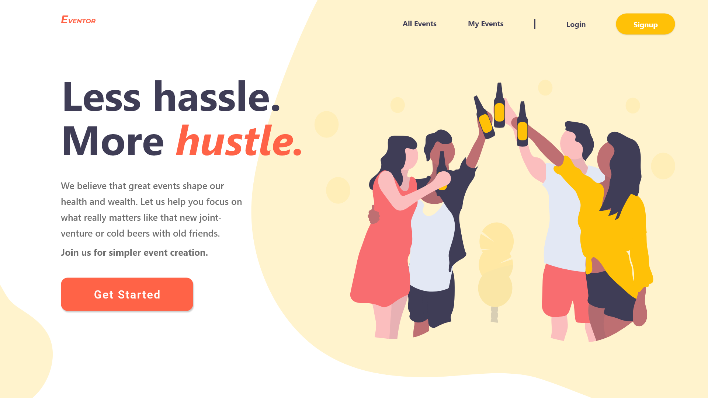

# private-events

## A [Project](www.theodinproject.com/courses/ruby-on-rails/lessons/associations) in Partial Completion of The Odin Project

The aim here was to build a site similar to [Eventbrite](www.eventbrite.com) which allows users to create events and then manage user signups.

## Goals
1. Set up user sign up and sign in
2. User can sign in and view events
3. User can sign in and attend events

## Skills Used/Gained
1. Database Schema and data architecture
2. Rails ActiveRecord Associations

## Site Function Goals:
    1. A user can create events
    2. A user can attend many events
    3. An event can be attended by many users

## Design

- While not implemented, this is the design I made in Adobe XD
- Site design was not regarded as important for this exercise in functionality*
 
